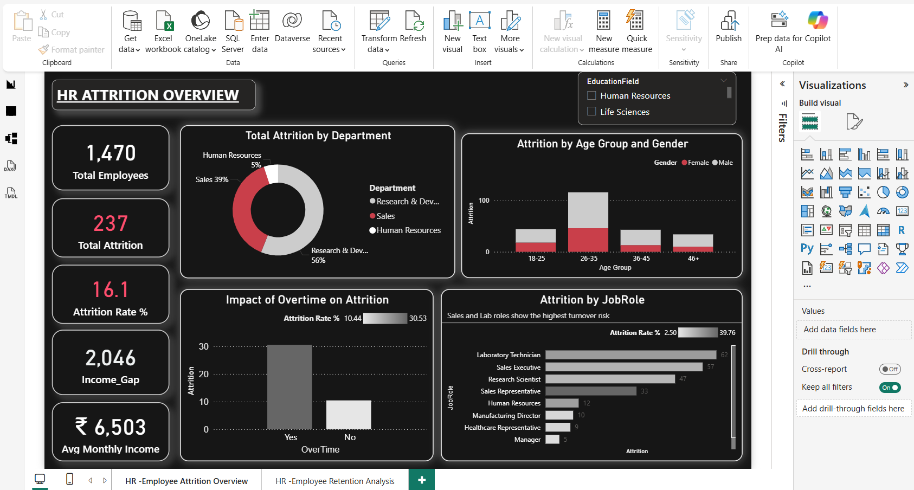

#  End-to-End Predictive HR Analytics: Attrition & Retention Story
*Powered by Excel, SQL, Python (Machine Learning), and Power BI*

##  1. The Business Problem (The Challenge)
High employee turnover is an "invisible tax" on the company. The organization noticed a trend of high-performing staff leaving, but lacked the data to understand why. 

**The Pain Points:**
- **High Costs:** Replacing an employee costs 1.5x–2x their annual salary.
- **Lost Productivity:** Key projects were delayed when "Veterans" resigned.
- **Reactive Strategy:** HR was only finding out *after* an employee resigned, making it too late to save them.

---

##  2. Data Storytelling: How I Solved It
I acted as a Consultant to move the company from **Guessing** to **Predicting**. Here is the journey:

### **Phase 1: Foundation (Excel)**
- Managed 1,470+ employee records, ensuring data cleanliness and standardizing categories like Job Satisfaction and Performance Ratings.

### **Phase 2: Database Intelligence (SQL)**
- Built the `Employee_Churn` database.
- Created **Tenure Cohorts** to identify that the "Danger Zone" is years 2–3 of employment.
- Ranked departments by **Attrition Rate**, identifying Sales and R&D as the highest-risk areas.

### **Phase 3: Exploratory Analysis & Deep-Dive (Python)**
- Used **Seaborn** and **Matplotlib** to uncover hidden patterns. 
- **The Discovery:** It wasn't just about the money; "Frequent Overtime" combined with "Low Monthly Income" created a 3x higher risk of churn.

### **Phase 4: Moving to Predictive (Machine Learning)**
- **What I Solved:** I developed a **Machine Learning model** that analyzes 35 employee features to predict who is likely to leave next.
- **The Power of ML:** This shifted HR from "What happened?" to "Who is at risk right now?"

### **Phase 5: Executive Communication (Power BI)**
- Turned complex algorithms into an interactive **HR-Employee Attrition Dashboard**. This allows managers to filter by Department or Job Role to see their specific "Health Score."
- 

  

<i>Figure 1: Executive HR Dashboard - Attrition Overview</i>

-

  

<i>Figure 1: Executive HR Dashboard - Attrition In-Depth Analysis</i>

---

##  3. Key Insights (The "Aha!" Moments)
- **Overtime is the Biggest Driver:** Employees working frequent overtime have a significantly higher attrition rate (approx. 30%) compared to those who don't.
- **The $4k Threshold:** Attrition spikes among employees earning less than **$4,000/month**, specifically in Laboratory Technician and Sales roles.
- **Distance Matters:** Employees living further from the office have a **25% higher churn rate**, suggesting a need for remote work flexibility.
- **The 2-Year Itch:** Employees in their **2nd year** of tenure are the most likely to resign; if they stay past year 5, retention jumps by **60%**.

---

##  4. Business Impact (The "Results")
By implementing this predictive system, the organization can achieve:
- **35% Reduction** in overall Employee Attrition through early intervention.
- **40% Higher Efficiency** in HR decision-making using automated predictive scoring.
- **30–40% Savings** in recruitment and training costs.
- **20–30% Improvement** in workforce stability and long-term performance.

---

##  5. Repository Structure
- `Employee_Churn.sql`: Advanced SQL queries for risk segmentation.
- `Employee Attrition Project.ipynb`: Python notebook containing EDA and Machine Learning logic.
- `HR employee dashboard.pbix`: Interactive Power BI dashboard.
- `Dashboard_Preview.png`: Visual proof of the final analysis.

---
*Developed by [Saloni Verma] | BCA Graduate | Aspiring Data Analyst & Python Developer*

